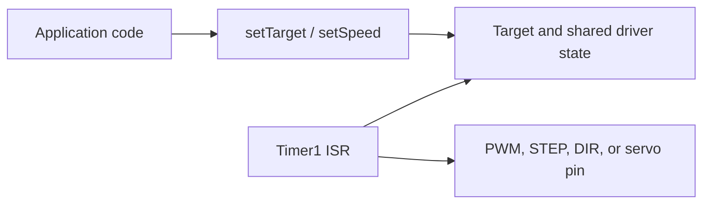

# Driver Architecture

This document explains the design behind the individual drivers. It is not a complete API reference; public APIs are declared in `include/motor_control/`. Its purpose is to explain why the code is split into public classes, shared state, and Timer1 interrupt handlers.

## Core Model

An AVR has a limited number of hardware timers. The library therefore performs most time-critical work inside Timer1 interrupts. A public driver class only registers a motor and stores the requested value; the ISR then produces the actual pin pulses.



This separation has two goals:

- The main program can wait for UART input, read sensors, or run application logic.
- Pulse timing does not depend on how long the main loop takes.

Values shared by the main program and an ISR are `volatile`. Writes of multi-byte values are protected with `cli()` and `sei()` where needed.

## Timer1 and Driver Compatibility

Timer1 can only use one configuration at a time, so not every driver can be freely combined in one program.

| Driver group | Timer1 mode | Purpose |
| --- | --- | --- |
| `DCControl`, `DCControlHBridge` | CTC, 4 ms period | Software PWM |
| `ServoControl` | CTC, 4 ms period | Servo pulses |
| `StepperContinuous` | CTC, prescaler 256 | Regular accumulator ISR |
| `StepperPositioning` | Normal mode, no prescaler | Dynamically scheduled STEP pulses |

DC and servo drivers use the same base Timer1 configuration, but the current implementation safely supports only one of these groups in a program. Each group independently schedules `OCR1B`, so using DC and servo drivers at the same time would require a shared Compare B arbiter. `StepperContinuous` and `StepperPositioning` use their own Timer1 configurations and must not be combined with the DC/servo group.

Timer setup may happen in a driver constructor, but global interrupts should only be enabled from `main()` after the application is initialized:

```cpp
int main() {
    // Initialize pins, UART, and driver objects.
    sei();
    while (true) {
    }
}
```

Calling `sei()` inside the constructor of a global object could allow ISRs to run before `main()` is entered.

## DCControl and DCControlHBridge

### Shared Scheduler

`DCControl` and `DCControlHBridge` have different public interfaces but share an implementation in `src/dc_control_common.cpp`.

Every registered motor occupies one `MotorSlot`:

- `pwm_pin` is the pin on which software PWM is generated.
- `target` is the value requested by the application.
- `current` is the value actually used for the current PWM period.
- `acceleration_step` is the precomputed ramp increment.
- An H-bridge slot also has `dir_a_pin` and `dir_b_pin`.

Separating `target` and `current` is a simple form of double buffering. The application changes `target`; the ISR adjusts `current` toward `target` at the beginning of each PWM period. PWM therefore does not jump immediately to a new value unless `setImmediate()` is used.

### Ramp

`setAcceleration(percent_per_decisecond)` accepts a value from `25` to `5000`. The scheduler converts it into the increment for one 4 ms period:

$$
\text{acceleration step} = \frac{\text{percent per 100 ms}}{25}
$$

There are 25 updates in 100 ms when the PWM period is 4 ms. The division happens only when acceleration is configured, not inside the ISR.

When the next step would exceed the target, `current` is set exactly to `target`.

### PWM for Multiple Motors

At the beginning of every period, the scheduler sets the PWM pin of every active motor HIGH. Each motor needs a falling edge at a time determined by its `current` value.

The scheduler therefore:

1. Creates a list of active motors.
2. Sorts them by absolute PWM value.
3. Sets `OCR1B` for the nearest falling edge.
4. In `TIMER1_COMPB_vect`, turns off one pin and schedules the next edge.

One Compare B register can therefore serve multiple software PWM outputs within one period.

### DCControl

`DCControl` has one PWM pin and accepts values from `0` to `1000`. It does not control motor direction; it is appropriate, for example, for an external module with a single enable/PWM input.

```cpp
DCControl motor(5);
motor.setAcceleration(500);
motor.setTarget(700);
```

### DCControlHBridge

`DCControlHBridge` has a PWM pin and two direction pins. It accepts values from `-1000` to `1000`; the sign selects the direction.

```cpp
DCControlHBridge motor(5, 4, 7);
motor.setTarget(600);
motor.setTarget(-600);
```

When the sign changes, the scheduler first ramps the motor down to zero. Only when `current == 0` does it disable both direction pins. Later ramp steps set the new direction and accelerate the motor in the opposite direction. This prevents an immediate H-bridge reversal while PWM is non-zero.

`setImmediate()` bypasses this protected ramp. It is intended for emergency stopping or deliberately immediate output changes.

## ServoControl

A servo needs a recurring pulse approximately once every 20 ms. Timer1 has a 4 ms period, so up to five servo channels are served in sequence:

1. On every `TIMER1_COMPA_vect`, the next servo slot is selected.
2. Its pin is set HIGH.
3. `OCR1B` is set to the pulse end time.
4. On `TIMER1_COMPB_vect`, the selected pin is set LOW.

After five 4 ms periods, every servo receives its next pulse, or one pulse every 20 ms.

The servo value is converted to a pulse width of roughly 1 to 2 ms. `ServoControl` has the same base Timer1 configuration as DC drivers, but the current implementation has no shared Compare B scheduler. Do not run servo and DC/H-bridge drivers concurrently yet.

## StepperContinuous

`StepperContinuous` controls a STEP/DIR driver at a requested continuous speed in steps per second.

It uses Timer1 in CTC mode with a prescaler of 256. The timer tick is 16 us and the ISR runs regularly. Every motor has:

- A target speed.
- A current speed.
- A step interval.
- An elapsed-time accumulator.
- A division remainder used to distribute timing error.

On each ISR, the accumulator grows by a fixed number of ticks. When it reaches the motor's interval, a STEP pulse is generated and the interval is subtracted from the accumulator. This allows multiple motors to be controlled without a separate timer for every motor.

Acceleration moves `current_speed` toward `target_speed` at regular ISR intervals. The direction pin is set from the sign of the target speed.

## StepperPositioning

`StepperPositioning` is intended for a finite movement by a requested number of steps rather than continuous rotation.

It uses Timer1 in normal mode without a prescaler. With a 62.5 ns tick, the ISR can schedule the next event very precisely:

- Overflow provides coarse timing for long intervals and acceleration changes.
- Compare A creates the STEP rising edge.
- Compare B creates the STEP falling edge shortly after Compare A.

The interval between steps is stored as `skip_count` and `remainder`. `skip_count` represents the number of full 16-bit overflows and `remainder` the remaining timer ticks. This representation supports long intervals without keeping a full 32-bit time value in the time-critical path.

The driver tracks `remaining_ticks`, the number of steps left until the target. While starting it shortens the interval; while braking it lengthens the interval. Braking distance helps decide when to change from acceleration to deceleration so the motor stops at its target.

## Simulator

The `simulator/` directory replaces AVR registers and `digitalWrite()` with host-side implementations. The timer simulator invokes the same callbacks as the corresponding ISRs and records pin changes in logs.

The simulator is useful for checking edge ordering, PWM duty cycle, and basic driver movement. It cannot replace real electrical behavior of a motor or H-bridge, and it cannot model missed stepper steps.

## Implementation Map

| Topic | File |
| --- | --- |
| DC and servo timer | `src/timer_control.cpp` |
| Shared DC/H-bridge scheduler | `src/dc_control_common.cpp` |
| Public DC wrapper | `src/dc_control.cpp` |
| Public H-bridge wrapper | `src/dc_control_hbridge.cpp` |
| Servo pulses | `src/servo_control.cpp` |
| Continuous stepper | `src/stepc_control.cpp` |
| Positioning stepper | `src/stepp_control.cpp` |
| Host-side simulator | `simulator/avr_simulator.cpp` |
